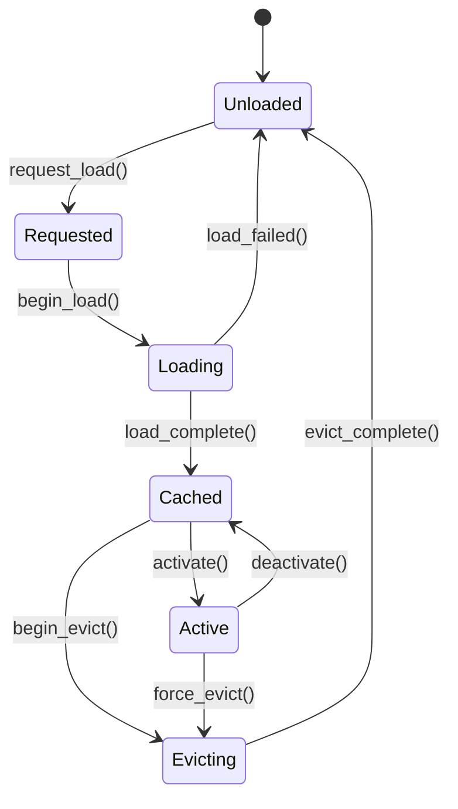

# World Streaming & Chunk Runtime

## Background

The Aether VR engine needs to stream large virtual worlds efficiently. Players move through
expansive environments that cannot fit entirely in memory. The existing `aether-world-runtime`
crate provides basic chunk descriptors (`ChunkDescriptor`, `ChunkKind`, `ChunkStreamingPolicy`)
and a runtime loop that processes boot/tick/stream/shutdown commands, but lacks a proper
chunk lifecycle state machine, spatial indexing, eviction policies, and streaming intelligence.

## Why

- Current chunk handling is flat: chunks are either "pending" or "loaded" with no intermediate states
- No spatial awareness for chunk loading decisions (no coordinate system)
- No eviction policy beyond simple max-visible-chunks cap
- No prefetch logic based on player movement direction
- No LOD-based progressive loading
- No occlusion portal gating to skip invisible chunks
- No chunk boundary stitching metadata for seamless transitions

## What

Implement a chunked world streaming pipeline as a `chunk` submodule within `aether-world-runtime`
that provides:

1. **ChunkCoord** - Spatial coordinate system for chunks (3D grid)
2. **ChunkState** - Lifecycle state machine (Unloaded -> Requested -> Loading -> Cached -> Active)
3. **ChunkManifest** - World manifest with chunk references, metadata, and portal definitions
4. **StreamingEngine** - Orchestrates chunk loading based on player position, direction, and LOD
5. **EvictionPolicy** - LRU with distance weighting for cache management

## How

### Module Structure

```
chunk/
  mod.rs           - Public API, re-exports
  coord.rs         - ChunkCoord, ChunkId, distance calculations
  state.rs         - ChunkState enum, state machine transitions, ChunkEntry
  manifest.rs      - ChunkManifest, PortalDefinition, BoundaryStitch
  streaming.rs     - StreamingEngine, prefetch logic, LOD selection
  eviction.rs      - EvictionPolicy, LRU + distance weighting
```

### Data Model

```
ChunkCoord { x: i32, y: i32, z: i32 }
ChunkId(u64)  -- derived from coord hash or manifest assignment

ChunkState:
  Unloaded    -- not in memory
  Requested   -- load requested, not yet started
  Loading     -- I/O in progress
  Cached      -- in memory but not rendered
  Active      -- in memory and rendered
  Evicting    -- being removed from memory
```

### State Machine



### Streaming Engine

The `StreamingEngine` maintains a set of `ChunkEntry` objects and processes each tick:

1. Compute desired set of chunks from player position + view direction + prefetch radius
2. Issue requests for chunks not yet loaded (respecting max_inflight budget)
3. Promote Cached chunks to Active if within active radius
4. Demote Active chunks to Cached if outside active radius
5. Run eviction pass on Cached chunks exceeding memory budget

### Eviction Policy

LRU with distance weighting: `score = time_since_last_access * distance_weight(dist_to_player)`

Chunks with highest score are evicted first. Distance weight increases quadratically with
distance from the nearest player.

### Prefetch Strategy

- Compute velocity vector from player movement
- Project forward by `prefetch_time_seconds` to get predicted position
- Load chunks in cone around predicted trajectory
- Higher LOD for near chunks, lower LOD for far chunks

### Occlusion Portal Gating

Portal definitions in the manifest describe connections between chunks. If a portal is
not visible from the player's current chunk, the connected chunk is deprioritized.

### Boundary Stitching

`BoundaryStitch` metadata stores which edges of adjacent chunks need geometry stitching,
preventing visible seams at chunk boundaries.

## Test Design

- **coord tests**: creation, equality, distance calculations, neighbor enumeration
- **state tests**: all valid transitions succeed, invalid transitions fail
- **manifest tests**: building manifests, portal definitions, validation
- **streaming tests**: prefetch radius, LOD selection, budget enforcement, tick processing
- **eviction tests**: LRU ordering, distance weighting, capacity enforcement

## Constants

All tunable parameters exposed as configurable fields with defaults defined as constants:
- `DEFAULT_CHUNK_SIZE`: 64.0
- `DEFAULT_ACTIVE_RADIUS`: 3
- `DEFAULT_CACHE_RADIUS`: 5
- `DEFAULT_MAX_CACHED_CHUNKS`: 128
- `DEFAULT_MAX_INFLIGHT_REQUESTS`: 16
- `DEFAULT_PREFETCH_TIME_SECS`: 2.0
- `DEFAULT_LOD_DISTANCES`: [128.0, 256.0, 512.0]
