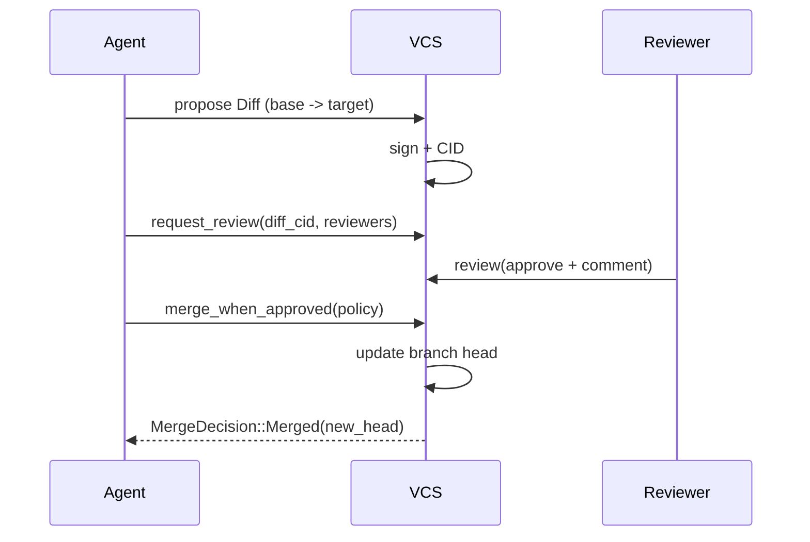

# World-as-Git VCS (Bet 5 / frogo #99 #100 #101 #102 #103 #104)

## Background

Aether is repositioning from a human-first VR/MMORPG engine to an
**agent-native engine** where AI agents are first-class authors of world
state. Agents must be able to (a) author worlds incrementally, (b)
propose changes for human or agent review, and (c) compose worlds
across federation boundaries without trust-by-default.

The `aether-world-vcs` crate implements a World-as-Git layer: every
mutation to a world is a signed, content-addressed diff; worlds have
branches, merges, rollbacks; federation is modeled as a remote.

## Why

Today's world mutations flow through state replication
(`crates/aether-network/src/delta.rs`) at the byte level; there is no
*authorial* history, review surface, or federation seam. An agent that
authors a large change cannot be audited, rolled back, or merged
against a concurrent human edit. For an engine where agents author
continuously, this is table stakes.

## What

A new crate `aether-world-vcs` providing:

1. A canonical content-addressed diff format with typed ops over
   entities, components, scripts and chunks.
2. A branch model (`main` default) with per-branch head + parentage.
3. A three-way merge algorithm producing either a merged diff or a
   structured `ConflictReport`.
4. `revert` / `rollback` semantics that never rewrite history.
5. A `Remote` seam for federation fetch/push (no-op in v1).
6. A review surface: human + agent reviewers, policies, merge gates.

The crate deliberately leaves world *storage* abstract. Callers supply
their own `BranchStore`; an in-memory implementation is provided.

## How

### Diff format

```
SignedDiff { diff: Diff, signature: Signature, public_key: PublicKey }
Diff {
  base:   Cid,
  target: Cid,
  ops:    Vec<Op>,
  author: AgentRef,
  timestamp_unix_ms: u64,
}
Op ::= AddEntity | RemoveEntity | ReplaceEntity
     | ModifyComponent { entity, component_name, value }
     | RetargetScript  { entity, old_script_cid, new_script_cid }
     | AddChunk | RemoveChunk | ReplaceChunk
```

Each `Diff` has a CID computed as `SHA-256` of the CBOR-encoded
canonical form. Canonical form orders struct fields alphabetically and
sorts map keys lexicographically (enforced by `ciborium` with the
`canonicalize` helper in `diff::canonical_cbor`). Bytes are then
hashed; the resulting 32-byte digest is the `Cid`.

A JSON Schema mirror is emitted to `docs/schemas/world-diff.v1.json`
via a unit test so the Rust types and docs stay locked.

### Branch model

```
Branch { name, head: Cid, parent_branch: Option<String>, created_by: AgentRef }
trait BranchStore {
    fn branch(&mut self, parent: Option<&str>, name: &str, by: AgentRef) -> Result<Branch>;
    fn head(&self, branch: &str) -> Result<Cid>;
    fn set_head(&mut self, branch: &str, head: Cid) -> Result<()>;
    fn list_branches(&self) -> Vec<String>;
}
```

An in-memory `MemoryBranchStore` is provided. The default branch is
created implicitly with name `main` and head = zero Cid.

### Merge semantics

Three-way merge between branches `A` and `B` with common ancestor `O`:

1. Project ops of `A \\ O` and `B \\ O`.
2. For each op, compute its *subject key* — a structural path that
   two ops clash on (see table below).
3. Non-overlapping ops (disjoint subject keys) are concatenated.
4. Overlapping subject keys raise a `Conflict` unless the two ops are
   byte-identical (then they collapse).

| Op                | Subject key                                   |
|-------------------|-----------------------------------------------|
| AddEntity(id)     | `entity:{id}`                                 |
| RemoveEntity(id)  | `entity:{id}`                                 |
| ReplaceEntity(id) | `entity:{id}`                                 |
| ModifyComponent   | `component:{entity}:{component_name}`          |
| RetargetScript    | `script:{entity}`                             |
| AddChunk(id)      | `chunk:{id}`                                  |
| RemoveChunk(id)   | `chunk:{id}`                                  |
| ReplaceChunk(id)  | `chunk:{id}`                                  |

Tests cover clean merge, conflicting component modification,
conflicting script retarget, and add/remove conflict.

### Revert & rollback

- `revert(diff)` returns an inverse `Diff`. Each op is inverted using
  the op's inverse rule (e.g. `AddEntity(id)` -> `RemoveEntity(id)`).
  `ModifyComponent` inversion requires the pre-image value (we carry a
  `prior_value: Option<Vec<u8>>` on the op for this).
- `rollback(branch, to_cid)` resets `branch.head` to `to_cid` and
  records the reset as a new *rollback diff* (sequence of inverse ops
  that mathematically lead from the current head to `to_cid`). No
  history is rewritten.

### Federation seam

```
Remote { name, url, public_key }
trait RemoteTransport {
    fn fetch(&mut self, remote: &Remote) -> Result<FetchResult>;
    fn push(&mut self, remote: &Remote, branch: &str) -> Result<PushResult>;
}
```

v1 ships a `NullTransport` returning empty fetch / successful push —
enough to test the API shape.

### Review surface

```
ReviewerRef ::= Human { user_id } | Agent { service_account }
ReviewStatus ::= Pending | Approved | Rejected | Withdrawn
Review { diff_cid, reviewers, status, comments }
MergePolicy ::= AllReviewers | Majority | AnyOneOf(Vec<ReviewerRef>)
```

Workflow:

1. `request_review(diff_cid, reviewers) -> Review`
2. `review(review, reviewer, status, comment) -> Result<()>`
3. `merge_when_approved(review, policy) -> MergeDecision`

### Database / storage design

No database in v1. All state lives behind `BranchStore` and
`ReviewStore` traits; in-memory impls for tests. Production deployments
plug into `aether-persistence` later (out of scope for this unit).

### API design

All public API is re-exported from `lib.rs`:

```
pub use branch::{Branch, BranchStore, MemoryBranchStore};
pub use diff::{Diff, Op, SignedDiff, Cid, cid_of, canonical_cbor};
pub use merge::{merge, MergeOutcome, Conflict, ConflictReport};
pub use remote::{Remote, RemoteTransport, NullTransport, FetchResult, PushResult};
pub use review::{Review, Reviewer, ReviewerRef, ReviewStatus, MergePolicy, MergeDecision,
                 ReviewStore, MemoryReviewStore};
pub use rollback::{revert, rollback};
pub use sig::{sign_diff, verify_signed_diff};
pub use error::{VcsError, Result};
```

### Test design

Integration tests under `tests/`:

- `diff_roundtrip.rs`: encode / decode a diff; verify CID stability;
  verify signature round-trip; emit JSON Schema file.
- `merge.rs`: clean merge, component-modification conflict,
  retarget-script conflict, add/remove conflict, no-op re-merge.
- `rollback.rs`: inverse-diff equivalence, rollback records a new
  diff (does not rewrite), idempotent re-rollback.
- `review.rs`: policy permutations, withdrawn reviews, rejected
  review blocks merge.

## Temporary dependency shim

The `aether-schemas` crate (U03 in the parallel batch) will own `Cid`,
`WorldManifest`, `Entity`, `Component`, `Chunk`, `ScriptArtifact`.
Until it lands, this crate ships its own minimal shim behind the
`shim` feature, enabled by default. Post-U03, a follow-up (frogo #74)
swaps the feature off and adds `aether-schemas` as a workspace dep.

## Workflow diagram


