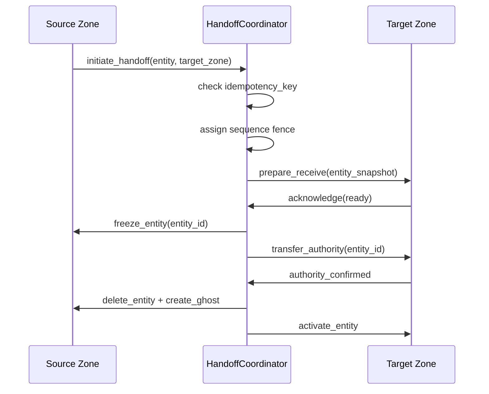

# Multi-Server Zone Handoff Implementation (task-006)

## Background

The `aether-zoning` crate provides structural primitives -- KdTree partitioning, HandoffProtocol types, GhostPolicy, and ZoneRuntime -- but lacks runtime coordination for actual cross-server entity migration. Entities cannot currently move between zone server processes, ghost entities are not managed at boundaries, and there are no ordering guarantees during handoff.

## Why

Without runtime handoff coordination, Aether cannot support seamless player movement across zone boundaries in a multi-server topology. Players hitting a zone edge would experience hard cutoffs or teleports. Ghost entities at boundaries are essential for rendering nearby players from adjacent zones. Authority transfer must be atomic to prevent duplication or ownership races.

## What

Implement runtime cross-server entity handoff with:

1. **HandoffCoordinator** -- state machine driving entity migration between zone processes
2. **GhostManager** -- lifecycle management of ghost entities at zone boundaries
3. **SequenceFenceTracker** -- ordering guarantees and gap detection during handoff
4. **AuthorityTransferManager** -- atomic authority transfer with rollback
5. **ZoneSplitMergeManager** -- dynamic zone topology changes based on player density
6. **IdempotencyGuard** -- deduplication of handoff messages

## How

### Architecture



### Module Design

#### `handoff.rs` -- HandoffCoordinator

The coordinator drives the handoff state machine:

- **States**: `Initiated -> Preparing -> Acknowledged -> Transferring -> Completed | Failed`
- Each handoff gets a unique `idempotency_key` (u128 used as UUID surrogate, no external deps)
- The coordinator maintains an in-flight map of active handoffs
- Timeout detection at each state transition

Key types:
```rust
pub struct HandoffRequest {
    pub entity_id: u64,
    pub source_zone: String,
    pub target_zone: String,
    pub position: [f32; 3],
    pub state_snapshot: Vec<u8>,
    pub idempotency_key: u128,
    pub sequence: u64,
}

pub enum HandoffState {
    Initiated,
    Preparing,
    Acknowledged,
    Transferring,
    Completed,
    Failed(String),
}

pub struct HandoffCoordinator {
    in_flight: HashMap<u128, ActiveHandoff>,
    completed_keys: HashSet<u128>,
    next_sequence: u64,
    timeout_ms: u64,
}
```

#### `ghost.rs` -- GhostManager (extends existing GhostCache)

Adds boundary-margin-aware ghost creation and zone adjacency tracking:

- `create_ghost_for_boundary()` -- when entity is within margin of zone edge
- `remove_ghosts_for_entity()` -- cleanup when entity moves away from boundary
- Boundary margin is configurable (default 10.0 world units)

#### `fence.rs` -- SequenceFenceTracker

Ensures ordering guarantees during handoff:

- Monotonically increasing sequence numbers per zone pair
- Gap detection: if sequence N+2 arrives before N+1, buffer it
- Configurable max gap before rejecting

```rust
pub struct SequenceFenceTracker {
    fences: HashMap<(String, String), u64>,  // (source, target) -> last_seen_seq
    pending: HashMap<(String, String), BTreeMap<u64, PendingMessage>>,
    max_gap: u64,
}
```

#### `authority.rs` -- AuthorityTransferManager (extends existing AuthorityRegistry)

Adds atomic transfer with prepare/commit/rollback:

- `prepare_transfer()` -- marks entity as pending, prevents new writes
- `commit_transfer()` -- atomically moves authority to target zone
- `rollback_transfer()` -- restores original authority on failure

#### `split_merge.rs` -- ZoneSplitMergeManager

Dynamic zone topology based on density:

- Monitors `LoadMetrics` per zone
- Triggers split when player count exceeds threshold for sustained period
- Triggers merge when adjacent zones are both below threshold
- Hysteresis: requires sustained condition for configurable hold period

#### Idempotency

Built into `HandoffCoordinator`:
- Every `HandoffRequest` carries a `u128` idempotency key
- Completed keys stored in a bounded set (LRU eviction after capacity)
- Duplicate requests return the cached result

### Database Design

N/A -- all state is in-memory for this crate. Persistence is handled by `aether-persistence`.

### API Design

All public via the module re-exports in `lib.rs`. No network endpoints; this is a library crate consumed by zone server processes.

### Test Design

All tests are in-memory unit tests:

1. **Handoff state machine** -- verify all state transitions, including failure paths
2. **Idempotency** -- duplicate requests return same result, not processed twice
3. **Ghost boundary** -- ghost created when entity is within margin, removed when outside
4. **Sequence fence** -- ordering enforced, gaps detected and buffered
5. **Authority transfer** -- prepare/commit/rollback atomicity verified
6. **Zone split** -- threshold triggers split with correct child zone specs
7. **Zone merge** -- under-populated adjacent zones merge
8. **Timeout** -- handoffs that exceed TTL transition to Failed

### File Organization

Each new module stays under 1000 lines. Tests are in a `tests` submodule within each file.

| File | Purpose | Est. lines |
|------|---------|-----------|
| `handoff.rs` | HandoffCoordinator + state machine + idempotency | ~350 |
| `ghost.rs` | Extended ghost management (modify existing) | ~200 total |
| `fence.rs` | SequenceFenceTracker | ~200 |
| `authority.rs` | Extended authority transfer (modify existing) | ~250 total |
| `split_merge.rs` | ZoneSplitMergeManager | ~250 |
| `lib.rs` | Module declarations + re-exports | ~30 |
