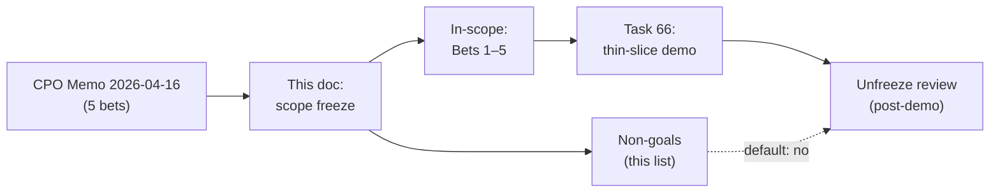
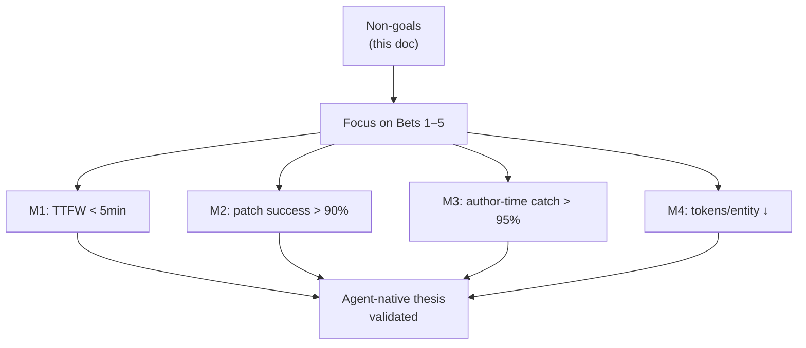

# Aether Agent-Native Engine — Non-Goals (Scope Freeze)

## Background

On 2026-04-16 the CPO strategy memo ratified a repositioning of Aether from a
human-first VR/MMORPG platform engine into an **agent-native engine** where AI
agents are first-class authors. The memo distills the repositioning into five
bets:

1. Canonical machine-authoring schemas (single source of truth for worlds,
   entities, behaviors, assets).
2. Agent-first authoring API (structured patch + verify loop, not chat).
3. Thin-slice agent-driven playable world demo (the ship-or-die milestone).
4. Author-time verification & contracts (bugs caught at author time, not
   run time).
5. World-as-git (versioned, branchable, mergeable worlds).

This document is the **scope-freeze companion** to that memo. The memo tells
the team what we *are* doing; this doc tells the team what we are explicitly
*not* doing, and why. Its purpose is defensive — to keep focus on the five
bets and prevent new work from leaking in while Bets 1–3 are in flight.

## Why this doc exists

A pivot is not complete when the strategy is written; it is complete when the
roadmap stops reflecting the old strategy. Aether has roughly three years of
accumulated design surface area aimed at human-authored, multiplayer,
VR/MMORPG use-cases. Much of that surface is still valuable, but most of it
is not on the critical path to proving the agent-native thesis.

Without an explicit non-goals list, three failure modes recur:

- **Drift by habit.** Engineers continue the workstreams they were in the
  middle of before the pivot, because nothing told them to stop.
- **Drift by request.** Stakeholders file new asks ("can we also…?") against
  the old mental model, and each one looks locally reasonable.
- **Drift by perfection.** Teams want to finish the current crate / service
  / design doc before moving on, and "finishing" expands to fit the time
  available.

The scope freeze in this doc is the tool we use to answer all three: we
point at the list, and the default answer is no until the thin-slice demo
(task 66) ships.

## Framing: what "agent-native" implies for cut decisions

Agent-native means the primary author is a program, not a person. That
changes the ranking of engineering values:

| Value                          | Human-first weight | Agent-first weight |
|--------------------------------|--------------------|--------------------|
| Visual polish of authoring UI  | High               | Low                |
| Reliability of the author API  | Medium             | Critical           |
| Machine-readable schemas       | Medium             | Critical           |
| Natural-language affordances   | High               | Medium             |
| Determinism & reproducibility  | Medium             | Critical           |
| Human-facing docs              | High               | Medium             |
| Agent-facing docs (schemas)    | Low                | Critical           |

Every item on the cut list below is a line item where the agent-first weight
tells us the work is either premature or misaligned.

The freeze is not permanent. Every non-goal below gets a re-litigation hearing
after the thin-slice demo lands. Until then, the default answer is no.

## The cut list

Each entry states the cut, the rationale tied back to the five bets, and the
trigger condition that would let it come back on the roadmap.

### 1. No new crates opened until the thin-slice demo ships

**Cut.** No new Rust crate (`aether-*`) may be created in the workspace until
task 66 (thin-slice agent-driven playable world demo) is merged to `main`
and demonstrably runs end-to-end.

**Rationale.** New crates are the single largest source of scope drift in
this codebase. Each one arrives with its own `Cargo.toml`, its own module
layout, its own tests, its own design doc, and — most expensively — its own
mental model that reviewers must hold. The thin-slice demo is what tells us
whether the five bets are correct; spending reviewer attention on new crate
boundaries before we have that signal is a bet against our own strategy.

**What this does not forbid.** Adding modules, types, systems, or
integration tests inside existing crates. Refactoring existing crates.
Deleting crates. Renaming crates.

**Trigger to unfreeze.** Task 66 merged, demo recorded, retro written.

**Cross-reference.** Task 66 (thin-slice demo) — explicit dependency.

### 2. `aether-creator-studio` scope narrowed to "view on canonical schema"

**Cut.** The creator studio stops being a human-parity visual editor. Its
new and only charter is: render a read-mostly view of the canonical schema
(Bet 1) so that humans can inspect what agents have authored. No WYSIWYG
editing, no visual scripting surface, no drag-and-drop timeline, no asset
browser beyond the minimum needed to confirm that an asset reference
resolves.

**Rationale.** A human-parity visual editor is a two-year effort that
competes directly with the thin-slice demo for engineering attention. More
fundamentally, if agents are the primary authors, the editor's job is
**inspection and override**, not creation. Building a full editor before we
know what agents need to be overridden is premature.

**What stays.** Schema-driven tree view of a world. Entity inspector.
Component value display. Diff viewer against a prior world revision
(pairs with Bet 5, world-as-git). "Open in external tool" links for assets.

**What is cut.** Timeline editor. Node-graph visual scripting. In-studio
asset import pipelines. Terrain sculpting. Avatar rigging UI. Multi-user
concurrent editing. "Publish to marketplace" flows.

**Trigger to unfreeze.** Post-demo, only if agent overrides are shown to
require a richer UI than inspect-and-diff.

### 3. `aether-federation` paused pending Bets 1 and 5

**Cut.** All active work on `aether-federation` (cross-instance world
handoff, protocol bridging, cross-shard identity, inter-server capability
negotiation) pauses. The crate may continue to exist; no new features land.

**Rationale.** Federation is a topology problem layered on top of a world
representation. If the canonical schema (Bet 1) changes — and it will, we
are designing it for agent authoring from the ground up — then any
federation protocol designed against the pre-pivot schema will have to be
torn out. Similarly, world-as-git (Bet 5) changes what "the same world on
two servers" even means: instead of mirrored live state, it becomes two
checkouts of the same world repo, which is a materially different federation
story.

Building federation before those two bets land is building on sand.

**Trigger to unfreeze.** Bet 1 (canonical schemas) at v1 stable, and Bet 5
(world-as-git) with a working repo/branch/merge primitive. Both conditions
required.

### 4. `aether-economy` settlement and velocity-fraud work pushed to v2

**Cut.** New settlement flows, velocity-based fraud detection, multi-party
escrow, cross-world currency bridges, and payout rails are all postponed to
a v2 economy track. The current ledger implementation stays in place as-is.

**Rationale.** The current ledger is sufficient for the thin-slice demo and
for any agent-authored world we will realistically demo in the next two
quarters. Settlement and fraud work are driven by a volume of real economic
activity that we do not yet have, and they bake in assumptions about who is
authoring (humans vs. agents) and at what cadence (interactive vs. batched)
that we are actively changing with this pivot.

**What stays.** The existing ledger, existing balance reads, existing
transaction log, existing economy integration tests. Bug fixes on all of
the above. No regressions.

**What is cut.** New settlement engines. Fraud heuristics. Payout
integrations with external processors. Currency exchange. Marketplace fee
schedules. Refund workflows.

**Trigger to unfreeze.** A shipped, monetized world with real transaction
volume. Not before.

### 5. Blockchain / NFT economy remains a non-goal

**Cut.** Aether does not ship a blockchain-integrated economy, NFT asset
wrappers, on-chain item provenance, or wallet-based authentication.

**Rationale.** This was a non-goal under the prior human-first strategy and
it remains a non-goal under the agent-native strategy, for the same
reasons: the technology adds latency, legal surface, and user friction
without buying anything we need. The agent-native pivot does not change the
calculus; if anything it makes chain-based provenance less interesting,
because agents can sign and verify authorship with the canonical schema
(Bet 1) directly.

**Trigger to unfreeze.** None contemplated. Reopen only on explicit CPO
direction with a written thesis.

### 6. Natural-language-first authoring is a non-goal

**Cut.** Aether's primary agent-authoring interface is a **structured DSL**
(see Bet 2, agent-first authoring API) — typed patches against the
canonical schema. Natural-language input is not the authoring primitive; at
most it is a convenience adapter on top.

**Rationale.** Natural language feels like the obvious agent interface
because LLMs speak it fluently. In practice it is the wrong primitive for
authoring, for three reasons:

- **Reliability.** A structured patch either type-checks against the schema
  or it does not. A natural-language instruction has no such ground truth
  and fails silently into plausible-but-wrong output.
- **Verifiability.** Author-time contracts (Bet 4) require a formal
  representation of the change to check against. Natural language is not
  that representation.
- **Token economics.** One of the success metrics (see below) is tokens per
  coherent content entity trending down. Natural-language round-trips
  inflate this; structured patches compress it.

**What this does not forbid.** A chat-style input surface that translates
natural language into structured patches before applying them. That is a
*UI* on top of the DSL, not a replacement for it.

**Trigger to unfreeze.** Evidence that structured DSL authoring has hit a
ceiling that NL authoring can pass. We do not expect this.

### 7. No new design docs until Bets 1–3 ship working code

**Cut.** `docs/design/` currently holds a large body of pre-pivot design
documents. Writing additional design documents under `docs/design/` is
paused until Bets 1, 2, and 3 have landed working, demonstrable code.

**Rationale.** The codebase currently has more design than it has code
aimed at the new strategy. Every additional design doc written before the
thin-slice demo ships is a doc written against assumptions that the demo is
very likely to invalidate. We are in the phase of the pivot where
implementation teaches us more than planning does.

**What stays.** This document (`docs/strategy/`). Short ADR-style notes
inline in code or in `docs/strategy/` as the five bets require them. README
updates. Updates to existing design docs when the code actually diverges
from them.

**What is cut.** New files under `docs/design/` for features, subsystems,
or services. Speculative architecture docs for crates that do not yet
exist. "Future work" docs.

**Trigger to unfreeze.** Bets 1, 2, and 3 have merged working code and the
thin-slice demo (task 66) is green.

## Success metrics this freeze protects

The non-goals above exist to protect four measurable outcomes. Any proposal
to reopen a cut must show it improves one of these metrics more than the
alternative use of the same engineering time.

1. **Time to first agent-driven playable world: < 5 minutes.**
   Wall-clock from "agent receives a world spec" to "human can walk around
   inside the resulting world." Today this is not measurable because the
   path does not exist. The thin-slice demo (task 66) is the instrument
   that makes it measurable.

2. **Agent-patch first-try success rate: > 90%.**
   Of structured patches an agent proposes against the canonical schema,
   90%+ should type-check and pass author-time contracts on the first
   attempt. This is the reliability dial that separates "agent authoring
   works" from "agent authoring almost works."

3. **Author-time bug catch rate: > 95%.**
   Of bugs that ever reach the runtime, fewer than 5% should have been
   catchable by the author-time contract system (Bet 4). This is the
   metric that says our verification layer is pulling its weight.

4. **Tokens per coherent content entity: trending down.**
   Cost per entity-worth-of-world authored, measured in LLM tokens, should
   decrease release over release. This is the efficiency dial; it is what
   makes the strategy economically viable at scale.

## Process for reopening a non-goal

A non-goal is reopened if, and only if, all of the following hold:

1. The thin-slice demo (task 66) has shipped, or the proposal demonstrates
   that the non-goal is blocking the demo itself.
2. A written proposal exists that (a) names which of the four success
   metrics the reopening improves, (b) estimates the improvement, and (c)
   identifies what other work is dropped to make room.
3. The CPO and the engineering lead for the affected crate both sign off
   in writing.

Anything short of all three: the answer is no, and the proposal is filed
for post-demo review.

## Relationship to existing roadmap artifacts

- This document supersedes any implicit scope commitments in
  `docs/design/*-implementation.md` files where they conflict with the
  five bets. Those docs are not deleted; they are now historical reference
  until the corresponding crate is revisited.
- Tasks in the tracker that are in-flight against a non-goal listed here
  should be closed with a link to this document. New tasks that fall under
  a non-goal should be rejected at intake with the same link.
- This document is paired with task 58 (overall repositioning) and
  specifically task 64 (this scope-freeze doc). Task 66 is the thin-slice
  demo whose completion is the primary unfreeze trigger.

## Sign-off

This document is ratified when both sign-offs below are filled in. Until
then it is a draft proposal; the cuts above are recommendations only.

| Role                    | Name | Date       | Signature |
|-------------------------|------|------------|-----------|
| CPO                     |      | YYYY-MM-DD |           |
| Engineering Lead        |      | YYYY-MM-DD |           |

Post-demo review owner: _(to be assigned at ratification)_.
Post-demo review date:  _(target: thin-slice demo merge + 2 weeks)_.
