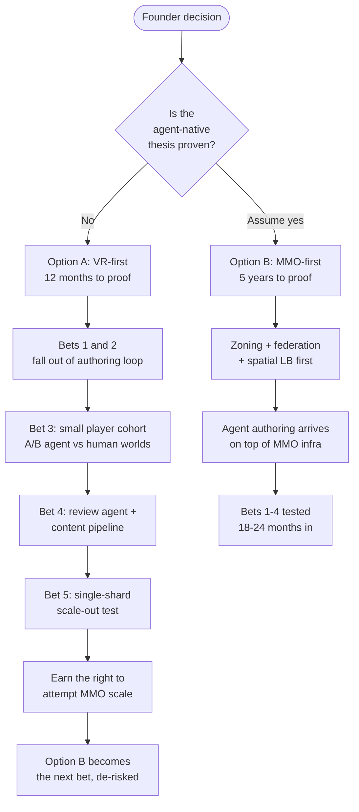
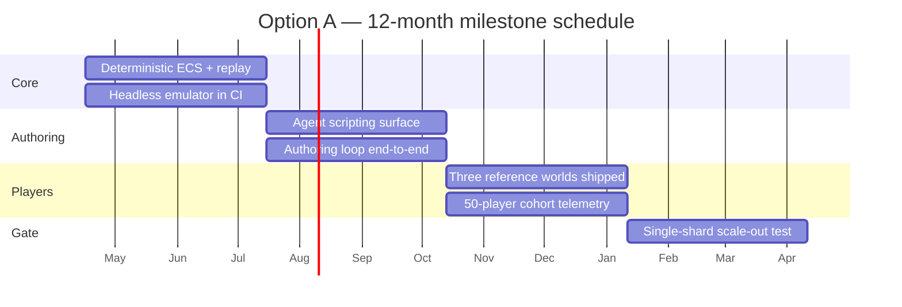

# Founder decision: VR-single-player-first vs MMO-first

Decision memo for the Aether Agent-Native Engine pivot (frogo task 65, unit U02 of
10). This document asks the founder to pick the engine shape for the next 12
months and to accept the consequences that pick has for the existing crate
surface.

## Framing: why this decision is load-bearing

Aether's current architecture is MMO-shaped. The repository already carries
`aether-zoning`, `aether-federation`, `aether-gateway`, `aether-registry`,
spatial load balancing, a trust-and-safety stack, and ~25 first-party crates
wired to support many concurrent players across federated shards. That shape
implies a 5-year horizon before any of the five agent-native bets are
meaningfully validated, because distributed world simulation, cross-shard hand
off, and federation governance have to land before an AI agent author can ship
an experience to real users.

The agent-native pivot makes a stronger claim: AI agents are the first-class
authors of Aether experiences. That claim is testable without MMO scale. A
single-player VR world with a deterministic ECS core, a scripting surface an
agent can safely target, reproducible asset pipelines, and an OpenXR / VR
emulator loop is enough to prove (or falsify) Bets 1 through 5 in roughly 12
months. It does so with ~10% of the infrastructure surface of the MMO path.

The decision is load-bearing because it dictates:

- Which crates stay in the critical path and which go on ice.
- Which team work items are funded in the next two quarters.
- Which demo and which narrative we take to design partners and investors.
- The earliest date at which the agent-native thesis is falsifiable.

If we pick wrong, we either (a) burn a year shipping MMO plumbing that no agent
is ready to drive, or (b) claim VR-single-player as a stepping stone but never
earn the right to attempt MMO scale because the thesis was never proven on the
smaller shot first.

The rest of this memo lays out both options, recommends VR-first, and captures
the consequences for the existing crate surface.

## The five bets, restated

The agent-native pivot rests on five bets. The options below are evaluated
against each.

1. Agents can author 3D worlds end-to-end given a typed, deterministic API
   surface.
2. Agents can iterate on those worlds inside a reproducible preview loop
   (headless VR emulator + deterministic ECS tick).
3. Players prefer agent-authored VR experiences to hand-authored ones at
   equivalent budget.
4. An agent-native content market clears: authoring agents, review agents,
   player agents, trust-and-safety agents.
5. The agent-native engine generalizes to shared worlds (MMO scale) once 1-4
   are true, without re-architecting the authoring surface.

Bets 1, 2, and 5 are directly testable in VR-single-player. Bet 3 requires a
small number of real players and a handful of agent-authored experiences. Bet
4 requires a review agent and a trust pipeline, but not federation.

## Options side-by-side

### Summary table

| Dimension                      | Option A: VR-single-player-first               | Option B: MMO-first                                    |
| ------------------------------ | ---------------------------------------------- | ------------------------------------------------------ |
| 12-month deliverable           | Single-player VR engine + agent authoring loop | Federated MMO shard with zoning + spatial LB alpha     |
| Headcount shape                | Small team, 5-8 engineers                      | Full team, 15-25 engineers                             |
| Infra surface in critical path | ~10 crates                                     | ~25 crates + services                                  |
| Time to first agent-authored demo | ~4 months                                   | ~14-18 months                                          |
| Time to falsify Bets 1-2       | ~6 months                                      | ~18 months                                             |
| Time to falsify Bet 5          | ~12 months (single-shard scale-out test)       | ~24 months (in-situ)                                   |
| Risk profile                   | Thesis-risk-first, infra-risk-deferred         | Infra-risk-first, thesis-risk-deferred                 |
| Worst case                     | Thesis fails cheaply                           | Thesis fails after 2-3 years of infra work             |
| Narrative for partners         | "Agents ship VR worlds today"                  | "Agents ship MMOs eventually"                          |
| Reversibility                  | Easy to resume MMO work from VR foundation     | Hard to rip out zoning/federation if thesis shifts     |

### Decision flow



### Option A: VR-single-player-first (recommended)

Concrete 12-month deliverable:

- A single-player VR engine binary that runs on Quest 3 (Android) and
  PC-via-OpenXR, with a headless VR emulator for CI.
- An agent authoring loop: an AI agent can, from natural-language intent,
  generate an ECS-backed world (entities, components, systems), hot-reload
  assets, and preview in the emulator within a single iteration cycle.
- A deterministic ECS tick guaranteeing that agent-authored scripts replay
  identically across the agent's authoring sandbox and the player's device.
- A persistence layer for per-player state (save/load) backed by
  `aether-persistence`.
- Three reference agent-authored worlds shipped to a private player cohort
  (~50 players) for Bet 3 data.
- A review agent + content-moderation pipeline sufficient to publish agent
  output without a human in every loop.
- A single-shard scale-out test at the end of month 12 that proves the
  authoring surface survives a move from one player to N players without
  redesign. This is the Bet 5 gate.

Infra surface touched (critical path):

- `aether-ecs` — core, must be deterministic and observable.
- `aether-scripting` — the surface an agent targets. Must be typed, sandboxed,
  and replay-safe.
- `aether-renderer` / `aether-renderer-soft` — VR rendering plus a software
  path for headless CI.
- `aether-openxr` — promoted from optional to critical.
- `aether-vr-emulator` — promoted to a first-class authoring target used by
  agents and by CI.
- `aether-input` — head and controller tracking, haptics.
- `aether-asset-pipeline` — reproducible, content-addressed, hot-reloadable.
- `aether-persistence` — per-player save state; critical.
- `aether-world-runtime` — single-shard runtime host.
- `aether-multiplayer` — retained for single-shard co-presence (up to a small
  party) and as the surface for the Bet 5 scale-out test.
- `aether-network` — retained; QUIC is still used for persistence sync and
  telemetry even in single-player.
- `aether-trust-safety` + `aether-content-moderation` — retained at a smaller
  scope focused on agent output review.
- `aether-creator-studio` — retained as the agent's authoring surface (agents
  call into the same API the studio exposes).
- `aether-cli`, `aether-build`, `aether-deploy` — retained; deploy target is
  Quest APK + PC binary, not federated servers.

Infra surface on ice:

- `aether-zoning` — no cross-zone handoff in single-player VR.
- `aether-federation` — no federated world registry needed in single-player.
- `aether-gateway` — no multi-service ingress needed; direct binary is fine.
- `aether-registry` — no world registry needed; local discovery only.
- Spatial load balancing service — not exercised.

Risk profile:

- Thesis-risk-first: within 6 months we know whether an agent can actually
  author a playable world, and within 12 we know whether players care.
- Infra-risk-deferred: we have not yet proven we can run shared shards, but we
  have not burned a year doing it either.
- Execution risk: small. The crate graph shrinks, team size shrinks, fewer
  moving parts.
- Reputational risk: we have to tell anyone expecting an MMORPG that we are
  taking the smaller shot first. Net positive if we ship.

How it proves the five bets:

- Bet 1 (agents can author): the authoring loop is the deliverable. If no
  agent can drive it, Bet 1 fails in month 4-6, cheaply.
- Bet 2 (reproducible preview): headless emulator + deterministic ECS is the
  preview loop. Falsifiable in month 3-4.
- Bet 3 (players prefer agent-authored): ~50-player cohort with A/B
  agent-vs-human worlds in months 9-12.
- Bet 4 (agent-native market clears): review agent ships in months 7-9; full
  market dynamics are out of scope but the primitives exist.
- Bet 5 (generalizes to shared worlds): month-12 scale-out test takes a
  single-player authoring surface and hosts it for N players on one shard
  without rewriting the authoring API. Passing this gate is what earns the
  right to attempt MMORPG scale.

How it fails to prove the bets: Bet 4's market dynamics are not fully
exercised — we will have one authoring agent, one review agent, and no
competitive market. This is an accepted gap, to be addressed post-gate.

### Option B: MMO-first

Concrete 12-month deliverable:

- Federated shard infrastructure with `aether-zoning` handing off across zones
  and `aether-federation` registering self-hosted worlds.
- Spatial load balancer alpha.
- `aether-gateway` plus `aether-registry` in production.
- Trust-and-safety stack live.
- A reference MMO world running on federated shards with ~200-500 concurrent
  players.
- Authoring is human-first through `aether-creator-studio`; agent authoring is
  a later phase.

Infra surface touched (critical path): effectively the full current crate
list. Every one of the ~25 crates stays hot.

Risk profile:

- Infra-risk-first: we spend 2-3 years building federation, zoning, and
  spatial LB before we find out whether agents can author worlds at all.
- Thesis-risk-deferred: the agent-native claim remains unfalsified. If it
  turns out agents cannot author worlds at the quality bar players want, we
  will have built the wrong engine.
- Execution risk: high. Distributed systems, consensus, cross-shard state,
  anti-cheat at scale, federation trust — each is a year of work.
- Burn risk: team size scales to match, so runway shrinks fast.

How it proves the five bets:

- Bets 1-4 are not directly tested for ~18-24 months. Bet 5 is tested
  continuously (shared-world scale is the whole deliverable) but without
  Bets 1-4 being proven first, Bet 5 is testing infra for a thesis we have not
  validated.
- If the agent-native thesis is wrong, we will have built a generic MMORPG
  engine. That is a fine thing, but it is not differentiated and it is a much
  more crowded market.

How it fails to prove the bets: it effectively defers the falsification of the
agent-native thesis by a year or more. The engine is built for the thesis but
cannot run the experiment that tests the thesis until year 2.

## Recommendation

Choose Option A: VR-single-player-first.

Rationale:

1. The agent-native thesis is the whole point of the pivot. The fastest path
   to falsifying or validating it is the correct path. VR-single-player gets
   us a falsification experiment in ~6 months and a validation signal in ~12.
   MMO-first defers that to year 2 or later.
2. Tighter iteration loop. Single-player + headless emulator + deterministic
   ECS is a loop an agent can run thousands of times per day. Federation is
   not.
3. We earn the right to attempt MMORPG scale by proving the authoring thesis
   first. The reverse path — attempting MMO first and hoping agents show up
   later — is how engines die.
4. Reversibility. A VR-first foundation is a strict subset of what the MMO
   path needs. `aether-ecs`, `aether-scripting`, `aether-renderer`,
   `aether-persistence`, and `aether-multiplayer` all carry forward. Nothing
   built in Option A is thrown away if we later pursue Option B.
5. Team and runway. The smaller infra surface matches a smaller team, which
   matches current runway, which matches the risk of the thesis itself being
   wrong.
6. Narrative. "Agents ship VR worlds today" is a story a design partner or
   investor can evaluate in a demo. "Agents will ship MMOs in three years" is
   a promise.

The gate at month 12 is the single-shard scale-out test. Passing it is how
Option B becomes the next bet, materially de-risked.

## Recommended 12-month milestone schedule

The schedule below is the recommended decomposition for Option A. It is
included so the founder can see what they are funding at each quarter and so
the "falsifiable in month N" claims above are concrete rather than rhetorical.

| Quarter | Theme                          | Exit criterion                                                                          |
| ------- | ------------------------------ | --------------------------------------------------------------------------------------- |
| Q1      | Deterministic core + emulator  | `aether-ecs` replay-identical on two hosts; headless emulator runs in CI                |
| Q2      | Agent authoring surface        | An agent can generate a world from intent and iterate in the emulator                   |
| Q3      | Player cohort pilot            | Three agent-authored worlds on Quest 3, ~50 players, telemetry in                       |
| Q4      | Single-shard scale-out gate    | Same authoring surface hosts N players on one shard; no authoring API changes required  |

Q1 falsifies Bet 2 early: either the ECS tick is deterministic and the emulator
replays the tick, or it does not. If it does not, we stop and fix the core
before burning quarters on downstream work.

Q2 falsifies Bet 1: either an agent can drive the authoring surface end-to-end
or the surface is mis-shaped for agents. Failure modes here are fixable
(reshape the scripting API, add more typed primitives, tighten the preview
loop) but the falsification is fast.

Q3 provides the first Bet 3 signal. Fifty players is not a statistically
powered study, but it is enough to tell the difference between "players bounce
in five minutes" and "players come back tomorrow."

Q4 is the Bet 5 gate and the checkpoint at which Option B becomes fundable
again.



## Consequences of choosing VR-first (Option A)

### Crates on ice

- `aether-zoning` — freeze. Keep the crate in the tree so design context is
  preserved; do not invest engineering cycles. Revisit after month-12 gate.
- `aether-federation` — pause. Schema and types are useful reference; no
  runtime work until Bets 1 and 5 are proven. Federation protocol work is
  postponed to a follow-on phase.
- `aether-gateway` — defer. Not in the binary-shipping path for single-player
  VR. Revisit when multi-service topology is needed.
- `aether-registry` — defer. Local world discovery only; no central registry.
- Spatial load balancing service — pause. Resumes when shared-shard work
  restarts after the gate.

### Crates critical, staying hot

- `aether-ecs` — promoted to the determinism-guaranteed core. Any ECS change
  that breaks replay is a release blocker.
- `aether-scripting` — promoted to the agent authoring surface. Must be
  typed, sandboxed, replay-safe, and easy for an LLM to target.
- `aether-persistence` — critical. Per-player state persistence is the main
  durable surface.
- `aether-multiplayer` — retained. Single-shard VR can still host small
  parties, and this crate is the host of the month-12 scale-out test.
- `aether-network` — retained. QUIC is still the transport for persistence
  sync, telemetry, and party co-presence.
- `aether-renderer`, `aether-renderer-soft` — critical. VR stereo render path
  plus a software path for headless CI.
- `aether-asset-pipeline` — critical. Content-addressed, hot-reloadable, and
  agent-friendly.
- `aether-world-runtime` — critical. Single-shard runtime host.
- `aether-creator-studio` — retained as the authoring API the agent calls
  into. Human-facing UI stays but is not the primary surface.
- `aether-trust-safety`, `aether-content-moderation` — retained, scope
  narrowed to agent output review.

### Crates promoted

- `aether-openxr` — promoted from optional to critical. First-class path for
  Quest 3 and desktop OpenXR runtimes.
- `aether-vr-emulator` — promoted to first-class. Agents and CI both preview
  worlds through this path. It is the deterministic replay target.

### Crates retained but lower priority

- `aether-audio`, `aether-spatial-audio` (in design) — retained, same
  priority as renderer.
- `aether-avatar` — retained; single-player still wants a player avatar with
  IK.
- `aether-physics` — retained, critical for VR interaction.
- `aether-input` — retained, critical for VR interaction.
- `aether-vr-overlay` — retained for debug and UI overlays.
- `aether-ugc`, `aether-economy`, `aether-social`, `aether-compliance` —
  retained in design, not actively developed until post-gate.
- `aether-security` — retained, scope focused on agent sandbox and asset
  provenance.

### Operational consequences

- No federation servers to host. No gateway to run. No zone handoff drills.
- Deploy target is a Quest APK and a desktop binary, not a Kubernetes fleet.
- CI runs the headless emulator on every commit; determinism regressions are
  caught by replay diff.
- Content review is a single agent-backed pipeline, not a full T&S org.

## Consequences of choosing MMO-first (Option B)

- Every current crate stays hot. `aether-zoning`, `aether-federation`,
  `aether-gateway`, `aether-registry`, spatial load balancing, and the full
  T&S stack are all critical path.
- Headcount must scale to ~15-25 engineers to stand up the distributed
  systems work in a reasonable window.
- Horizon is 5 years before the agent-native thesis has a clear signal.
- No early thesis test. We will have spent two years before finding out
  whether agents can author playable worlds at all.
- Higher burn, lower optionality. If the thesis falters, the engine we have
  built is a generic MMORPG engine competing in a crowded market.
- Narrative is weaker with design partners and investors: promise-shaped
  rather than demo-shaped.
- Reversibility is poor. Unwinding zoning or federation if the thesis shifts
  is expensive; the code is entangled with the runtime.

## Month-12 gate: what "pass" looks like, concretely

The gate is the only objective signal that converts this memo into a go / no-go
for Option B. It deserves a precise definition so that a month-12 review is
not a subjective conversation.

Gate pass criteria (all four must hold):

1. Authoring surface stability. The scripting surface an agent used to build a
   single-player world in month 6 is the same scripting surface that hosts N
   players on a single shard in month 12. No forced breaking changes.
2. Determinism preserved under multi-agent load. The ECS tick remains
   deterministic with multiple connected players. Replays captured on the
   server reproduce on an emulator running on a developer laptop.
3. Player signal. Of the ~50-player cohort from Q3, at least a third return
   for a second session within a week. This is a weak bar deliberately;
   stricter bars require more players than the cohort supports.
4. Review agent correctness. The content review agent gated every world that
   reached the cohort. False-negatives (bad content reaching players) are
   zero. False-positives (good content blocked) are tracked but do not fail
   the gate.

Gate fail modes and their meanings:

- If (1) fails, the scripting surface is wrong. Fix before attempting MMO.
- If (2) fails, the ECS is not ready for sharing. Fix before MMO.
- If (3) fails and (1)(2) held, the thesis is falsified or the worlds were
  bad. Either outcome is a founder-level discussion, not a gate rubber-stamp.
- If (4) fails, the trust pipeline needs more investment before any public
  launch.

## Open questions for the founder

1. Do we publicly re-describe Aether as an "agent-native VR engine" for the
   next 12 months, or do we hold the narrative private until the month-12
   gate passes? The answer changes what we tell design partners, the
   community, and any press we talk to.
2. What is the precise month-12 gate? Candidate: "one agent authors one
   world, fifty players play it, and the world runs on a single shared shard
   with 20 concurrent players without authoring changes." Is that the right
   bar, or should it be tighter / looser?
3. Which agent do we target first as the authoring agent — a frontier general
   model, a fine-tuned smaller model, or a scaffolded agent stack? This
   directly shapes the `aether-scripting` surface.
4. Do we commit to Quest 3 as the primary VR target, with PC-OpenXR as a
   secondary dev target, or the reverse? Either is defensible; the choice
   drives renderer and input priorities.
5. What happens to team members currently staffed on federation, zoning, and
   spatial LB? Redirect to ECS / scripting / emulator, or accept a
   short-term headcount reduction and rehire after the gate?

## Sign-off

Founder: __________________________

Date: __________________________

Decision captured:

- [ ] Option A: VR-single-player-first (recommended)
- [ ] Option B: MMO-first
- [ ] Defer decision; reconvene by: __________________________

Notes from founder:

```
(space reserved for founder notes, constraints, and follow-up asks)
```

---

Author: frogo task 65 (unit U02 of the agent-native pivot batch).
Status: awaiting founder sign-off.
